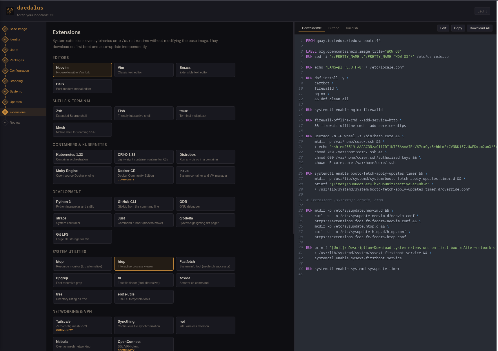

# Daedalus

A web wizard for building custom bootable Linux images. Configure packages, users, extensions, firewall rules, and branding through a visual interface - download a Containerfile and build script that produce a ready-to-boot qcow2 disk image.



## What it does

1. Walk through 10 steps: Base Image, Identity, Users, Packages, Config, Branding, Systemd, Updates, Extensions, Review
2. Download the generated files as a zip (Containerfile + build.sh)
3. Run `./build.sh` - it builds the container and creates a bootable disk image
4. Boot in QEMU, import into Proxmox, or write to USB

## Quick start

```bash
git clone https://github.com/c4rt0/daedalus.git
cd daedalus
npm install
npm run dev
```

Open http://localhost:5173 and configure your OS.

## How the build pipeline works

The generated `build.sh` does everything:

```
Containerfile → podman build → bootc install to-disk → qcow2
```

- **Container build**: `sudo podman build --net=host` — layers your packages onto `fedora-bootc:44`
- **Disk image**: `bootc install to-disk --via-loopback` — creates a raw disk, converts to qcow2
- **Boot**: `qemu-system-x86_64 -nographic -drive if=virtio,file=disk.qcow2` — serial console, SSH ready

Users and SSH keys are baked into the container image via `useradd` + `~/.ssh/authorized_keys`. No Ignition needed.

## Supported base images

| Image | Description |
|-------|-------------|
| Fedora 44 | Latest stable (default) |
| Fedora Rawhide | Bleeding edge |
| CentOS Stream 10 | Enterprise-adjacent |
| CentOS Stream 9 | Older enterprise |
| Custom | Any bootc-compatible image |

## Supported output formats

| Format | Use case | Status |
|--------|----------|--------|
| qcow2 | QEMU, libvirt, Proxmox | Verified |
| AMI | AWS | Verified |
| VMDK | VMware | Verified |
| VHD | Azure, Hyper-V | Verified |
| GCE | Google Cloud | Verified |
| ISO | Bare metal, USB install | Requires legacy builder |

## Package presets

Web Server, Dev Workstation, Desktop (GNOME/KDE), Kiosk, Monitoring, Minimal Server — or add any package manually.

## Deploy

### Proxmox LXC

Create a Debian 12 container (256MB RAM, 2GB disk is enough):

```bash
# On the Proxmox host
pct create <VMID> local:vztmpl/debian-12-standard_12.12-1_amd64.tar.zst \
  --hostname daedalus --memory 256 --cores 1 \
  --rootfs local-lvm:2 --net0 name=eth0,bridge=vmbr0,ip=dhcp \
  --unprivileged 1 --start 1
```

Then install inside the container:

```bash
# Install Node 22 (Debian 12 ships 18, Vite needs 20+)
apt update && apt install -y nginx curl git
curl -fsSL https://deb.nodesource.com/setup_22.x | bash -
apt install -y nodejs

# Build and serve
git clone https://github.com/c4rt0/daedalus.git /opt/daedalus
cd /opt/daedalus && npm install && npm run build
cp -r dist/* /var/www/html/
systemctl restart nginx
```

Access at `http://<LXC-IP>`.

### Docker

```bash
docker build -t daedalus .
docker run -p 8080:80 daedalus
```

### Static build

```bash
npm run build
# Serve dist/ with any web server
```

## Tech stack

React + Vite, plain CSS, no backend. Everything runs client-side.

## Further reading

- [bootc documentation](https://bootc.dev/bootc/) — bootable containers reference
- [image-builder](https://github.com/osbuild/image-builder) — generates disk images from container images
- [Butane specification](https://coreos.github.io/butane/) — config format for Ignition first-boot provisioning
- [Fedora CoreOS docs](https://docs.fedoraproject.org/en-US/fedora-coreos/) — getting started, provisioning, updates
- [Fedora bootc images](https://quay.io/organization/fedora) — official base images on Quay.io

## License

MIT
